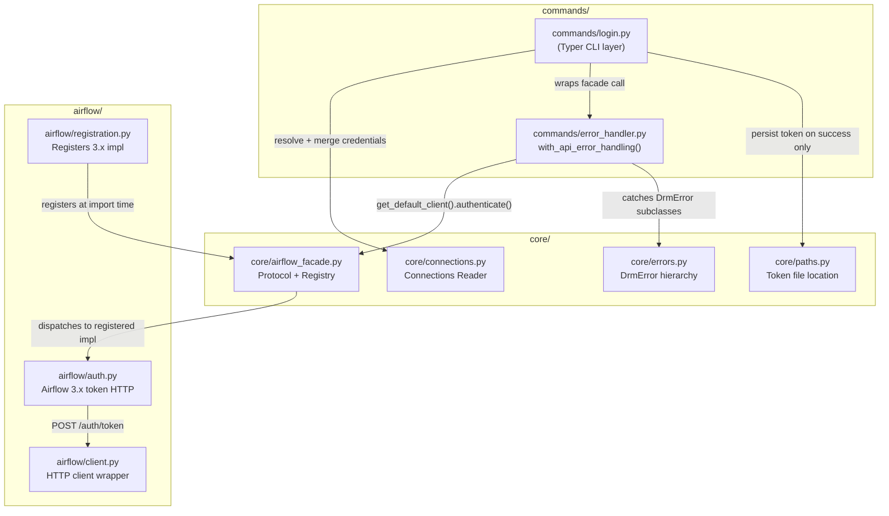
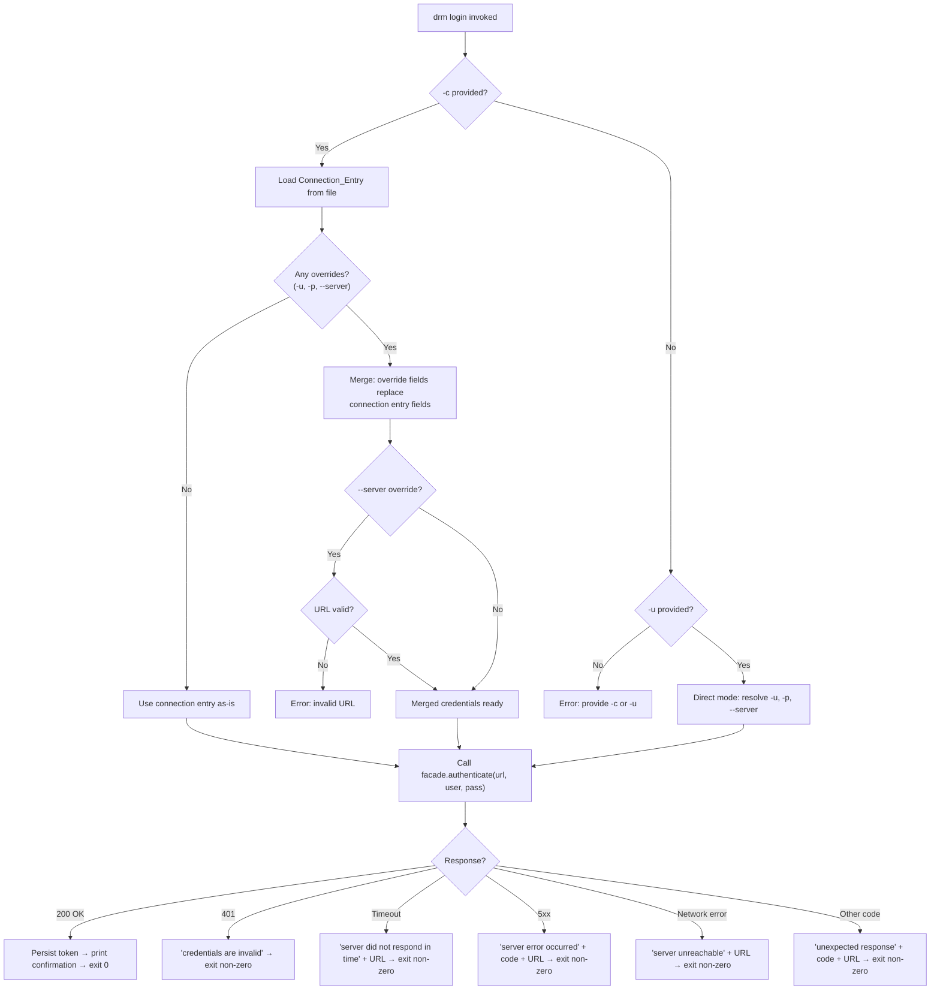

# Design Document

## Overview

This feature extends `drm login` with a connection-file mode (`-c <name>`) that looks
up named Airflow connections from `~/.drm/connections.json`. The design introduces:

- A **Connections Reader** in `core/connections.py` that parses, validates, and secures
  the connections file.
- A **Facade + Registry** pattern in `core/airflow_facade.py` that decouples commands
  from concrete Airflow HTTP implementations.
- A separate **`airflow/` package** (`src/drm/airflow/`) containing the Airflow 3.x
  token-acquisition HTTP logic.
- **Credential override merging** when `-c` is combined with `-u`, `-p`, or `--server`:
  each flag replaces its corresponding field from the connection entry.
- **Structured authentication outcome handling** covering success, 401, timeout, 5xx,
  network errors, and unexpected HTTP codes.

The existing direct-login behaviour is preserved. Both modes delegate to the same
facade, ensuring credential safety and token persistence are handled identically
regardless of how credentials are sourced.

## Architecture



### Credential Resolution Flow



### Key Architectural Decisions

1. **Facade with Registry (Open/Closed Principle)** — `core/airflow_facade.py` defines
   a `typing.Protocol` for the authentication interface and a module-level registry.
   Commands call `get_default_client().authenticate(url, username, password)` and never
   import from `airflow/` directly. When Airflow 4.x arrives, a new `airflow4/` package
   registers its implementation — zero changes to commands or core logic.

2. **Separate `airflow/` package** — HTTP-specific Airflow implementation lives in
   `src/drm/airflow/`, not inside `core/`. This keeps `core/` free of HTTP concerns
   and allows multiple API-version packages to coexist.

3. **Override model (not mutual exclusivity)** — The `-c` flag and direct-mode flags
   (`-u`, `-p`, `--server`) are NOT mutually exclusive. When combined, direct-mode
   flags act as field-level overrides on the connection entry. This enables quick
   ad-hoc testing (e.g., `drm login -c prod -u admin`) without creating new entries.
   The only error is when neither `-c` nor `-u` is provided.

4. **Token persistence stays in `core/`** — `core/paths.py` handles token file
   location and atomic writes. The `airflow/` package only returns the token string;
   persistence is the command's responsibility via core utilities.

5. **Connections Reader in `core/`** — `core/connections.py` handles file I/O, JSON
   parsing, schema validation, and POSIX permission checks. It raises `DrmError`
   subclasses and has no Typer dependency.

6. **Structured error types for auth outcomes** — Distinct error classes for each
   failure mode (timeout, server error, unexpected response) enable the command layer
   to produce specific, actionable messages without inspecting raw HTTP responses.

7. **Shared error-handling wrapper in `commands/`** — A higher-order function
   `with_api_error_handling(url, operation)` in `commands/error_handler.py`
   centralizes the try/except block that catches `DrmError` subclasses and exits
   with standardized messages. Commands call this wrapper instead of repeating
   the same pattern. It lives in `commands/` (not `core/`) because it uses
   `typer.echo` and `typer.Exit` — CLI-layer concerns that `core/` must not
   import. Any new command that calls the facade (e.g., `drm measure`) reuses
   the same wrapper with zero duplication.

### Directory Structure

```
src/drm/
├── commands/
│   ├── error_handler.py      # reusable API error-handling wrapper
│   ├── login.py              # calls facade, never airflow/ directly
│   └── measure.py            # drm measure (also uses error_handler)
├── core/
│   ├── connections.py        # reads ~/.drm/connections.json
│   ├── airflow_facade.py     # facade + registry + Protocol definitions
│   ├── paths.py              # token file location per platform
│   ├── errors.py             # DrmError hierarchy
│   └── __init__.py
└── airflow/
    ├── __init__.py
    ├── auth.py               # Airflow 3.x token acquisition (POST /auth/token)
    ├── client.py             # httpx-based HTTP client
    └── registration.py       # registers airflow 3.x impl into the registry
```

## Components and Interfaces

### `core/airflow_facade.py` — Protocol + Registry

```python
"""Facade defining the auth client protocol and implementation registry."""

from __future__ import annotations

from dataclasses import dataclass
from typing import Protocol


@dataclass(frozen=True, slots=True)
class AuthResult:
    """Successful authentication outcome."""

    token: str
    expires_at: str  # ISO 8601


class AirflowAuthClient(Protocol):
    """Protocol for Airflow authentication implementations."""

    def authenticate(
        self, url: str, username: str, password: str
    ) -> AuthResult:
        """Exchange credentials for a token.

        Raise DrmError subclasses on failure (network, credentials, timeout,
        server error, unexpected response).
        """
        ...


# Module-level registry
_registry: dict[str, AirflowAuthClient] = {}
_default_key: str | None = None


def register_client(key: str, client: AirflowAuthClient, *, default: bool = False) -> None:
    """Register an auth client implementation."""
    _registry[key] = client
    global _default_key
    if default or _default_key is None:
        _default_key = key


def get_default_client() -> AirflowAuthClient:
    """Return the registered default auth client.

    Raise RuntimeError if no client is registered (programming error).
    """
    if _default_key is None or _default_key not in _registry:
        msg = "No Airflow auth client registered. Ensure airflow package is imported."
        raise RuntimeError(msg)
    return _registry[_default_key]
```

### `core/connections.py` — Connections Reader

```python
"""Read and validate ~/.drm/connections.json."""

from __future__ import annotations

import json
import os
import stat
from dataclasses import dataclass
from pathlib import Path

from drm.core.errors import DrmError


class ConnectionFileNotFoundError(DrmError): ...
class ConnectionFileMalformedError(DrmError): ...
class ConnectionEntryInvalidError(DrmError): ...
class ConnectionNotFoundError(DrmError): ...
class ConnectionFilePermissionError(DrmError): ...


@dataclass(frozen=True, slots=True)
class ConnectionEntry:
    """A single named connection."""

    name: str
    url: str
    username: str
    password: str


def get_connections_path() -> Path:
    """Return the canonical connections file path."""
    return Path.home() / ".drm" / "connections.json"


def read_connections(path: Path | None = None) -> dict[str, ConnectionEntry]:
    """Parse and validate the connections file.

    Performs POSIX permission checks on non-Windows systems.
    Returns a dict mapping connection names to entries.
    """
    ...


def get_connection(name: str, path: Path | None = None) -> ConnectionEntry:
    """Look up a single connection by name.

    Raises ConnectionNotFoundError with available names if not found.
    """
    ...
```

**Key behaviours:**
- POSIX: rejects files with mode > `0o600` or `st_uid != os.getuid()`
- Windows: skips permission checks
- Case-sensitive name matching
- Extra fields in entries are silently ignored
- Empty file (`{}`) parses to an empty dict

### `core/errors.py` — Extended Error Hierarchy

```python
"""Base exception hierarchy for user-facing errors."""


class DrmError(Exception):
    """Base class for all errors surfaced to the CLI user."""


class AuthenticationError(DrmError):
    """Credentials rejected by the server (HTTP 401)."""


class NetworkError(DrmError):
    """Server unreachable — DNS failure, connection refused, etc."""


class TimeoutError(DrmError):
    """Server did not respond within the configured timeout."""

    def __init__(self, url: str) -> None:
        self.url = url
        super().__init__(f"Server did not respond in time: {url}")


class ServerError(DrmError):
    """Server returned an HTTP 5xx response."""

    def __init__(self, status_code: int, url: str) -> None:
        self.status_code = status_code
        self.url = url
        super().__init__(
            f"A server error occurred (HTTP {status_code}): {url}"
        )


class UnexpectedResponseError(DrmError):
    """Server returned an unexpected HTTP status code (not 200, 401, or 5xx)."""

    def __init__(self, status_code: int, url: str) -> None:
        self.status_code = status_code
        self.url = url
        super().__init__(
            f"Unexpected response (HTTP {status_code}): {url}"
        )
```

### `core/paths.py` — Token Persistence

```python
"""Per-platform token file location and atomic write."""

from __future__ import annotations

from dataclasses import dataclass
from pathlib import Path


@dataclass(frozen=True, slots=True)
class TokenData:
    """Persisted token with metadata."""

    token: str
    server: str
    expires_at: str  # ISO 8601


def get_token_path() -> Path:
    """Return the per-platform token file path."""
    ...


def save_token(data: TokenData) -> None:
    """Atomically write token data to the token file."""
    ...


def load_token() -> TokenData | None:
    """Load and validate the stored token. Return None if missing/expired."""
    ...
```

### `airflow/auth.py` — Airflow 3.x Implementation

```python
"""Airflow 3.x token acquisition via POST /auth/token."""

from __future__ import annotations

import httpx

from drm.core.airflow_facade import AuthResult
from drm.core.errors import (
    AuthenticationError,
    NetworkError,
    ServerError,
    TimeoutError,
    UnexpectedResponseError,
)


class Airflow3AuthClient:
    """Airflow 3.x JWT authentication client."""

    def authenticate(
        self, url: str, username: str, password: str
    ) -> AuthResult:
        """POST to {url}/auth/token to exchange credentials for a JWT.

        Raises:
            AuthenticationError: HTTP 401
            TimeoutError: request timed out
            ServerError: HTTP 5xx
            UnexpectedResponseError: any other non-200 status
            NetworkError: DNS failure, connection refused, etc.
        """
        ...
```

### `airflow/registration.py` — Auto-Registration

```python
"""Register the Airflow 3.x auth client at import time."""

from drm.airflow.auth import Airflow3AuthClient
from drm.core.airflow_facade import register_client

register_client("airflow3", Airflow3AuthClient(), default=True)
```

This module is imported in `cli.py` (or `airflow/__init__.py`) to ensure
registration happens before any command runs.

### `commands/error_handler.py` — Reusable API Error-Handling Wrapper

```python
"""Reusable error-handling wrapper for API operations.

All commands that call the facade pass their operation through this wrapper
instead of repeating the same try/except block. The wrapper catches DrmError
subclasses from HTTP operations and exits with appropriate messages and codes.

This module lives in commands/ (not core/) because it uses typer.echo and
typer.Exit — CLI-layer concerns that core/ must not import.
"""

from __future__ import annotations

from typing import TypeVar, Callable

import typer

from drm.core.errors import (
    AuthenticationError,
    NetworkError,
    ServerError,
    TimeoutError,
    UnexpectedResponseError,
)

T = TypeVar("T")


def with_api_error_handling(url: str, operation: Callable[[], T]) -> T:
    """Execute an API operation with standardized error handling.

    Invoke *operation* and return its result on success. On failure, print a
    user-friendly message to stderr and raise typer.Exit(code=1).

    Parameters
    ----------
    url:
        The target server URL, included in error messages for context.
    operation:
        A zero-argument callable that performs the API call (e.g., a lambda
        wrapping ``get_default_client().authenticate(...)``).

    Returns
    -------
    T
        The return value of *operation* when it succeeds.

    Raises
    ------
    typer.Exit
        On any DrmError subclass caught from *operation*.
    """
    try:
        return operation()
    except AuthenticationError:
        typer.echo("The provided credentials are invalid.", err=True)
        raise typer.Exit(code=1)
    except TimeoutError as exc:
        typer.echo(
            f"The server did not respond in time: {exc.url}", err=True
        )
        raise typer.Exit(code=1)
    except ServerError as exc:
        typer.echo(
            f"A server error occurred (HTTP {exc.status_code}): {exc.url}",
            err=True,
        )
        raise typer.Exit(code=1)
    except UnexpectedResponseError as exc:
        typer.echo(
            f"Unexpected response (HTTP {exc.status_code}): {exc.url}",
            err=True,
        )
        raise typer.Exit(code=1)
    except NetworkError:
        typer.echo(f"Server unreachable: {url}", err=True)
        raise typer.Exit(code=1)
```

**Key design decisions:**

1. **Higher-order function, not a context manager.** The wrapper returns the
   result of the operation directly, which is ergonomic for single-expression
   calls: `result = with_api_error_handling(url, lambda: client.authenticate(...))`.
   A context manager would require assigning inside a `with` block and wouldn't
   naturally propagate the return value.

2. **Lives in `commands/`, not `core/`.** The function uses `typer.echo` and
   `typer.Exit`, which are CLI-layer concerns. The architecture rule "core/
   must never import typer" means this wrapper belongs in the commands layer.
   It is shared across all command modules (`login.py`, `measure.py`, etc.).

3. **Generic return type.** `TypeVar("T")` lets callers get proper type
   inference — `authenticate()` returns `AuthResult`, `get_task_instances()`
   returns `list[TaskInstance]`, and the wrapper preserves those types.

4. **URL parameter for NetworkError.** `NetworkError` may not carry the URL
   (DNS failure can happen before URL is associated with the exception), so
   the wrapper accepts `url` explicitly to include it in the message.

### `commands/login.py` — Revised Command (Override/Merge Logic)

```python
"""The drm login command — connection mode with overrides and direct mode."""

from typing import Annotated

import typer

from drm.commands.error_handler import with_api_error_handling
from drm.core.airflow_facade import get_default_client
from drm.core.connections import get_connection, ConnectionEntry
from drm.core.errors import DrmError
from drm.core.paths import save_token, TokenData


def _validate_url(url: str) -> bool:
    """Check that url starts with http:// or https://."""
    return url.startswith(("http://", "https://"))


def _resolve_credentials(
    connection: str | None,
    username: str | None,
    password: str | None,
    server: str | None,
) -> tuple[str, str, str]:
    """Resolve final (url, username, password) from flags + connection entry.

    Override logic:
    - If -c provided, load the connection entry as base credentials.
    - If -u/-p/--server also provided, they OVERRIDE the corresponding field.
    - If -c not provided, -u is required (direct mode).

    Returns (url, username, password) ready for authentication.
    Raises DrmError on validation failure.
    """
    if connection is None and username is None:
        raise DrmError(
            "Provide -c <name> for connection mode, or -u <username> for direct mode."
        )

    if connection is not None:
        # Load base credentials from connection file
        entry = get_connection(connection)
        final_url = entry.url
        final_username = entry.username
        final_password = entry.password

        # Apply overrides
        if username is not None:
            final_username = username
        if password is not None:
            final_password = password
        if server is not None:
            if not _validate_url(server):
                raise DrmError(f"Invalid URL: {server}")
            final_url = server
    else:
        # Direct mode: -u is required (already checked above)
        final_username = username  # type: ignore[assignment]
        final_password = password or _prompt_or_env_password()
        final_url = server or _resolve_server()

    return final_url, final_username, final_password


def login(
    connection: Annotated[str | None, typer.Option("-c", help="Connection name")] = None,
    username: Annotated[str | None, typer.Option("-u", help="Username")] = None,
    password: Annotated[str | None, typer.Option("-p", help="Password")] = None,
    server: Annotated[str | None, typer.Option("--server", help="Server URL")] = None,
) -> None:
    """Authenticate against Airflow and persist a token."""
    # 1. Resolve + merge credentials (connection entry + overrides, or direct)
    url, user, passwd = _resolve_credentials(connection, username, password, server)

    # 2. Authenticate via facade — errors handled by shared wrapper
    result = with_api_error_handling(
        url, lambda: get_default_client().authenticate(url, user, passwd)
    )

    # 3. Persist token (only on success — never reached on failure)
    save_token(TokenData(token=result.token, server=url, expires_at=result.expires_at))

    # 4. Print confirmation (never echo token or password)
    typer.echo(f"Logged in to {url} — token expires {result.expires_at}")
```

## Data Models

### Connection Entry (in-memory)

| Field | Type | Source |
|---|---|---|
| `name` | `str` | JSON key in connections file |
| `url` | `str` | Required field in entry |
| `username` | `str` | Required field in entry |
| `password` | `str` | Required field in entry |

### Connections File (on-disk JSON)

```json
{
  "production": {
    "url": "https://airflow.example.com",
    "username": "deploy_bot",
    "password": "s3cret"
  },
  "staging": {
    "url": "https://airflow-staging.example.com",
    "username": "dev_user",
    "password": "dev_pass",
    "notes": "extra fields are ignored"
  }
}
```

**Schema rules:**
- Top-level: JSON object (not array)
- Each value: object with required `url`, `username`, `password` (non-empty strings)
- Additional fields in entries are silently ignored
- File location: `~/.drm/connections.json`
- POSIX permissions: must be `0o600` or stricter, owned by current user

### Auth Result

| Field | Type | Description |
|---|---|---|
| `token` | `str` | JWT string (never logged) |
| `expires_at` | `str` | ISO 8601 timestamp |

### Token File (on-disk JSON)

```json
{
  "token": "eyJ...",
  "server": "https://airflow.example.com",
  "expires_at": "2026-07-24T10:00:00+00:00"
}
```

Location per platform as defined in `core/paths.py` (see AGENTS.md §7).

## Correctness Properties

*A property is a characteristic or behavior that should hold true across all valid
executions of a system — essentially, a formal statement about what the system should
do. Properties serve as the bridge between human-readable specifications and
machine-verifiable correctness guarantees.*

### Property 1: Connection lookup round-trip

*For any* valid connections file and any connection name present in that file,
looking up the connection SHALL return a `ConnectionEntry` whose `url`, `username`,
and `password` fields exactly match the values stored under that key in the JSON,
and authenticating with those credentials SHALL produce a token persisted with the
correct `server` URL.

**Validates: Requirements 1.1, 1.2**

### Property 2: Credential safety — passwords and tokens never leak

*For any* password string and any token string, no output produced by the login
command (stdout, stderr, error messages, exception details) SHALL contain the
password or token value, regardless of whether authentication succeeds or fails,
and regardless of whether connection mode, direct mode, or override mode is used.

**Validates: Requirements 1.4, 2.6, 2.7, 7.1, 7.2, 7.3, 7.4**

### Property 3: Credential override merging

*For any* connection entry and any subset of override flags (`-u`, `-p`, `--server`
with a valid URL), the merged credentials SHALL use each provided override for its
corresponding field while preserving all non-overridden fields from the connection
entry unchanged. Multiple overrides in one invocation SHALL each apply independently.

**Validates: Requirements 3.1, 3.2, 3.3, 3.6**

### Property 4: Connections file parsing preserves all required fields

*For any* valid JSON object where each value contains `url`, `username`, and
`password` as non-empty strings (possibly with additional fields), parsing the
connections file SHALL return entries with those exact field values, and additional
fields SHALL be silently discarded.

**Validates: Requirements 4.2**

### Property 5: Invalid connection entry validation

*For any* connection name and any of the three required fields (`url`, `username`,
`password`) being missing or empty, the Connections Reader SHALL raise an error whose
message contains both the connection name and the name of the invalid field.

**Validates: Requirements 4.5**

### Property 6: Missing connection name error includes context

*For any* connection name that does not exist in the connections file (including
case-only variants of existing names), the error SHALL contain the requested name
AND list all available connection names. Case-sensitive matching SHALL be enforced.

**Validates: Requirements 5.1, 5.2, 5.3**

### Property 7: POSIX permission enforcement

*For any* file permission mode with group or world bits set (i.e., `mode & 0o077 != 0`),
the Connections Reader on a POSIX system SHALL reject the file and raise an error
instructing the user to fix permissions.

**Validates: Requirements 6.1, 6.2**

### Property 8: All reader errors are DrmError subclasses

*For any* error condition raised by the Connections Reader (file not found, malformed
JSON, invalid entry, missing connection, permission violation), the exception SHALL be
an instance of `DrmError`.

**Validates: Requirements 8.3**

### Property 9: Success outcome includes server URL and expiry

*For any* successful authentication (regardless of mode), the output SHALL contain
the target server URL and the token expiry timestamp in ISO 8601 format, and the
token SHALL be persisted to the Token_File, and the exit code SHALL be 0.

**Validates: Requirements 1.3, 9.1**

### Property 10: Server error messages include status code and URL

*For any* HTTP status code in the range 500–599 returned by the server, the error
message SHALL contain the numeric status code and the target server URL.

**Validates: Requirements 9.4**

### Property 11: Unexpected response messages include status code and URL

*For any* HTTP status code that is not 200, not 401, and not in the range 500–599
(e.g., 403, 404, 429), the error message SHALL contain the numeric status code and
the target server URL, and SHALL state that the response was unexpected.

**Validates: Requirements 9.7**

### Property 12: Token file invariant on failure

*For any* authentication failure (401, timeout, 5xx, network error, unexpected
response), the Token_File SHALL NOT be created or modified. If a Token_File existed
before the attempt, its contents SHALL remain unchanged.

**Validates: Requirements 9.5**

## Error Handling

### Error Hierarchy

```
DrmError
├── ConnectionFileNotFoundError     # ~/.drm/connections.json missing
├── ConnectionFileMalformedError    # Invalid JSON content
├── ConnectionEntryInvalidError     # Missing/empty required field
├── ConnectionNotFoundError         # Name not in file
├── ConnectionFilePermissionError   # POSIX mode/ownership violation
├── AuthenticationError             # Server rejected credentials (HTTP 401)
├── NetworkError                    # Server unreachable (DNS, connection refused)
├── TimeoutError                    # Server did not respond in time
├── ServerError                     # HTTP 5xx response
└── UnexpectedResponseError         # HTTP code not in {200, 401, 5xx}
```

### Error Messages (credential-safe)

| Condition | Message Template |
|---|---|
| File not found | `Connections file not found: {path}` |
| Malformed JSON | `Connections file is malformed (invalid JSON): {path}` |
| Missing field | `Connection "{name}": field "{field}" is missing or empty` |
| Empty field | `Connection "{name}": field "{field}" is missing or empty` |
| Name not found | `Connection "{name}" not found. Available: {list}` |
| Bad permissions | `Connections file has insecure permissions. Run: chmod 600 {path}` |
| Bad ownership | `Connections file has unexpected ownership. Delete and recreate: {path}` |
| Invalid URL override | `Invalid URL: {url}` |
| Credentials invalid (401) | `The provided credentials are invalid.` |
| Timeout | `The server did not respond in time: {url}` |
| Server error (5xx) | `A server error occurred (HTTP {status_code}): {url}` |
| Network error | `Server unreachable: {url}` |
| Unexpected response | `Unexpected response (HTTP {status_code}): {url}` |
| No mode selected | `Provide -c <name> for connection mode, or -u <username> for direct mode.` |
| No server resolved | `No server URL provided. Use --server, set DRM_SERVER, or configure a default.` |

**Rule:** No message template includes `{password}` or `{token}`. Error classes
deliberately exclude credential fields from `__init__` parameters to make leakage
structurally impossible.

### Exception Sanitization

When catching unexpected exceptions during HTTP calls (which may include credentials
in URLs or request bodies), the command layer wraps them in the appropriate typed
error with a safe message, discarding the original exception's string representation.
The original is preserved only via `__cause__` for developer debugging (which is not
printed by `cli.py`'s handler).

### Token File Protection on Failure

The `save_token()` call is placed AFTER the `authenticate()` call returns
successfully. All failure paths (`except` branches) exit before reaching
`save_token()`, so the Token_File is never created or modified on failure.
This is enforced by control flow structure rather than a rollback mechanism.

## Testing Strategy

### Why Property-Based Testing Applies

This feature has multiple pure functions with meaningful input variation:

- **Connection parsing** — arbitrary JSON structures with varying field presence
- **Connection lookup** — arbitrary names against arbitrary connection sets
- **Credential merging** — arbitrary connection entries × arbitrary override combinations
- **Permission checking** — full range of POSIX mode bits
- **Credential safety** — arbitrary password/token strings against output capture
- **Error code handling** — ranges of HTTP status codes (5xx, unexpected)

These are ideal candidates for property-based testing with Hypothesis.

### PBT Library

**Hypothesis** (Python) — the standard PBT library for Python projects.

Add to dev dependencies:
```toml
[dependency-groups]
dev = [
  # ... existing deps ...
  "hypothesis>=6",
]
```

### Property Test Configuration

- Minimum **100 examples** per property test (Hypothesis default is 100)
- Each test tagged with: `# Feature: connection-file-login, Property {N}: {title}`
- Tests located in `tests/core/test_connections.py`, `tests/core/test_airflow_facade.py`,
  and `tests/commands/test_login_integration.py`

### Test File Structure

```
tests/
├── core/
│   ├── test_connections.py          # Properties 4–8, plus edge-case examples
│   ├── test_airflow_facade.py       # Property 1 (round-trip), registry tests
│   └── __init__.py
├── airflow/
│   ├── test_auth.py                 # Airflow 3.x HTTP mocking (respx), error mapping
│   └── __init__.py
├── test_cli.py                      # Existing + login CLI tests (thin)
└── commands/
    ├── test_error_handler.py        # Unit tests for with_api_error_handling wrapper
    └── test_login_integration.py    # Properties 2, 3, 9, 10, 11, 12 + mode validation
```

### Dual Testing Approach

**Property-based tests** (Hypothesis):

| Property | Test Location | What Varies |
|---|---|---|
| 1: Lookup round-trip | `test_airflow_facade.py` | Connection file contents, names |
| 2: Credential safety | `test_login_integration.py` | Password/token strings, failure modes |
| 3: Credential override merging | `test_login_integration.py` | Connection entries, override subsets |
| 4: Parsing preserves fields | `test_connections.py` | JSON structures, extra fields |
| 5: Invalid entry validation | `test_connections.py` | Connection names, which field is invalid |
| 6: Missing name error | `test_connections.py` | Available names, requested names, case variants |
| 7: POSIX permissions | `test_connections.py` | File mode bits (0o000–0o777) |
| 8: DrmError subclasses | `test_connections.py` | All error trigger conditions |
| 9: Success outcome output | `test_login_integration.py` | Server URLs, expiry timestamps |
| 10: Server error messages | `test_login_integration.py` | HTTP codes 500–599 |
| 11: Unexpected response messages | `test_login_integration.py` | HTTP codes not in {200,401,5xx} |
| 12: Token file invariant | `test_login_integration.py` | All failure types |

**Example-based unit tests:**

| Scenario | Test Location | Validates |
|---|---|---|
| Direct mode happy path | `test_cli.py` | Req 2.1 |
| Password prompt when -p omitted | `test_cli.py` | Req 2.2 |
| DRM_PASSWORD env fallback | `test_cli.py` | Req 2.3 |
| Server resolution chain | `test_cli.py` | Req 2.4 |
| Neither mode provided (no -c, no -u) | `test_cli.py` | Req 3.5 |
| Invalid URL override | `test_cli.py` | Req 3.4 |
| Connection mode + -u override | `test_cli.py` | Req 3.1 |
| Connection mode + -p override | `test_cli.py` | Req 3.2 |
| Connection mode + --server override | `test_cli.py` | Req 3.3 |
| Connection mode + multiple overrides | `test_cli.py` | Req 3.6 |
| File not found error | `test_connections.py` | Req 4.3 |
| Invalid JSON error | `test_connections.py` | Req 4.4 |
| Empty file parses OK | `test_connections.py` | Req 4.6 |
| POSIX permission error message | `test_connections.py` | Req 6.2 |
| Ownership mismatch error | `test_connections.py` | Req 6.3 |
| Windows skips perm checks | `test_connections.py` | Req 6.4 |
| HTTP 401 error message | `test_login_integration.py` | Req 9.2 |
| Timeout error message | `test_login_integration.py` | Req 9.3 |
| Network error (DNS/refused) | `test_login_integration.py` | Req 9.6 |
| Airflow 3.x POST /auth/token | `test_auth.py` | Req 1.1 (HTTP) |
| Airflow 3.x timeout handling | `test_auth.py` | Req 9.3 (HTTP) |
| Airflow 3.x 5xx handling | `test_auth.py` | Req 9.4 (HTTP) |
| Registry returns default client | `test_airflow_facade.py` | Architecture |

### Mocking Strategy

- **HTTP calls**: `respx` for mocking `httpx` in `airflow/auth.py` tests
- **File system**: `tmp_path` + `monkeypatch` for connections file and token file
- **Platform**: `monkeypatch` on `os.name`, `os.getuid()`, `os.stat()` for
  cross-platform permission tests
- **Facade**: In command-level tests, mock `get_default_client()` to return a fake
  that either succeeds or raises the appropriate error type, avoiding any HTTP
- **Timeout/network errors**: Mock `httpx.Client.post` to raise `httpx.TimeoutException`
  or `httpx.ConnectError` to test error mapping in `airflow/auth.py`
