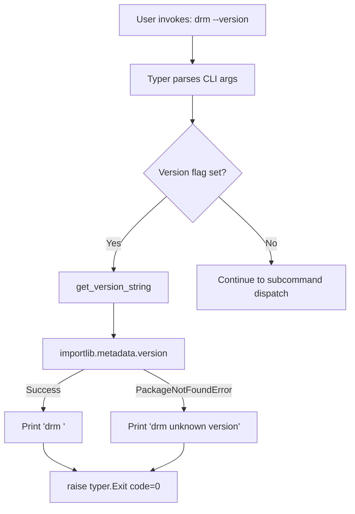

# Design Document: version-flag

## Overview

This feature adds a `--version` / `-v` flag to the root `drm` Typer application. The flag is implemented as a Typer callback on the root app that, when triggered, prints `drm <version>` to stdout and exits with code 0. The version string is resolved at runtime from installed package metadata via `importlib.metadata.version("drm")`, with a graceful fallback to `drm (unknown version)` when metadata is unavailable (e.g., during development without an editable install).

The implementation is minimal: a single callback function added to `cli.py` that short-circuits before any subcommand runs.

## Architecture

The version flag integrates at the Typer app level using the `callback` decorator pattern. Typer callbacks execute before any subcommand, making them the correct mechanism for flags that should take precedence over all subcommands.



### Design Decisions

1. **Typer callback approach**: Using `@app.callback()` with an `invoke_without_command=True` root app lets the version flag fire before subcommand routing. This naturally implements the "version takes precedence" requirement (1.3).

2. **`importlib.metadata` over `__version__`**: The requirements mandate reading from package metadata. This is the canonical Python approach (PEP 566 / PEP 639), avoids maintaining a duplicate version in `__init__.py`, and works correctly with the `uv_build` backend.

3. **Version logic stays in `cli.py`**: The version retrieval is a 5-line function with no business logic beyond a try/except. Extracting it to `core/` would be over-engineering — it's purely a CLI concern (formatting a print + exit). The `core/` boundary rule ("no typer imports") is preserved because the retrieval helper itself doesn't import typer — only the callback does.

4. **`eager=True` on the Option**: Typer's `eager` parameter ensures the version callback fires during parsing, before any parameter validation on subcommands. This prevents errors like "missing required argument" when the user types `drm --version measure`.

## Components and Interfaces

### Modified: `src/drm/cli.py`

The main CLI assembly file gains:

```python
def _get_version_string() -> str:
    """Return the installed package version, or a fallback if unavailable."""
    from importlib.metadata import PackageNotFoundError, version

    try:
        return version("drm")
    except PackageNotFoundError:
        return "(unknown version)"


def _version_callback(value: bool) -> None:
    """Print version and exit when --version / -v is passed."""
    if value:
        typer.echo(f"drm {_get_version_string()}")
        raise typer.Exit()
```

The app callback is updated to accept the version option:

```python
@app.callback()
def _root_callback(
    version: Annotated[
        bool | None,
        typer.Option(
            "--version",
            "-v",
            help="Show the version and exit.",
            callback=_version_callback,
            is_eager=True,
        ),
    ] = None,
) -> None:
    """Measure per-task processing time for an Airflow DAG run."""
```

### Interface Contract

| Function | Input | Output | Side Effects |
|---|---|---|---|
| `_get_version_string()` | None | `str` — version or `"(unknown version)"` | None |
| `_version_callback(value: bool)` | `True` when flag present | None (raises `typer.Exit`) | Prints to stdout |

### Modified: `src/drm/__init__.py`

The hardcoded `__version__ = "0.1.0"` can remain as a convenience for programmatic access, but the CLI will not use it. No changes required.

## Data Models

This feature introduces no new data models. The only data involved is:

- **Input**: A boolean flag value (`True` when `--version` or `-v` is passed)
- **Output**: A formatted string `"drm {version}\n"` written to stdout

No persistence, no state, no complex types.

## Correctness Properties

*A property is a characteristic or behavior that should hold true across all valid executions of a system — essentially, a formal statement about what the system should do. Properties serve as the bridge between human-readable specifications and machine-verifiable correctness guarantees.*

### Property 1: Version output format is correct for any version string

*For any* valid version string returned by `importlib.metadata.version("drm")` and *for either* flag form (`-v` or `--version`), invoking the CLI with that flag SHALL produce exactly `drm <version>\n` on stdout, produce no output on stderr, and exit with code 0.

**Validates: Requirements 1.1, 1.2, 2.1, 2.2, 3.1, 3.2, 3.3**

### Property 2: Version flag takes precedence over subcommands

*For any* valid version string and *for any* combination of the version flag with additional CLI arguments (subcommands, subcommand arguments, other flags), the CLI SHALL print the version string in the correct format and exit with code 0 without executing the subcommand.

**Validates: Requirements 1.3**

## Error Handling

| Condition | Behaviour | Exit Code |
|---|---|---|
| `importlib.metadata.version("drm")` succeeds | Print `drm <version>\n` to stdout | 0 |
| `importlib.metadata.version("drm")` raises `PackageNotFoundError` | Print `drm (unknown version)\n` to stdout | 0 |
| Version flag not provided | Normal subcommand dispatch (no change) | — |

Error handling is deliberately simple:

- The `PackageNotFoundError` is caught inside `_get_version_string()` and returns the fallback string. No exception propagates.
- `typer.Exit()` with no code argument defaults to exit code 0.
- No output is ever written to stderr by the version flag path (Requirements 3.3, 4.2).
- The version callback does not interact with `DrmError` — it short-circuits before any business logic runs.

## Testing Strategy

### Unit Tests (example-based)

Located in `tests/test_cli.py` (extending the existing file):

1. **`test_version_long_flag`** — Invoke with `--version`, assert output is `drm <actual_version>\n` and exit code 0.
2. **`test_version_short_flag`** — Invoke with `-v`, assert output matches `--version`.
3. **`test_version_flag_with_subcommand`** — Invoke with `--version measure -dag x -id y -output o -format csv`, assert version printed and exit code 0.
4. **`test_version_missing_metadata`** — Mock `importlib.metadata.version` to raise `PackageNotFoundError`, assert output is `drm (unknown version)\n`.
5. **`test_version_no_stderr`** — Assert stderr is empty for both success and fallback paths.
6. **`test_version_aliases_same_option`** — Verify `-v` and `--version` are registered as aliases of a single Typer Option (not two separate options).

### Property-Based Tests (Hypothesis)

Located in `tests/test_cli.py` or a dedicated `tests/test_version_property.py`:

- **Library**: `hypothesis` (already in dev dependencies)
- **Minimum iterations**: 100 per property
- **Tag format**: `# Feature: version-flag, Property N: <text>`

**Property 1 test**: Generate random version strings (using `hypothesis.strategies.from_regex` for PEP 440 versions), mock `importlib.metadata.version` to return the generated string, invoke CLI with both `-v` and `--version`, assert:
  - stdout == `f"drm {version}\n"`
  - exit code == 0

**Property 2 test**: Generate random combinations of subcommand names and arguments alongside the version flag, invoke CLI, assert:
  - stdout contains version output
  - exit code == 0

### Test Configuration

```python
from hypothesis import given, settings
import hypothesis.strategies as st

# Strategy for PEP 440-ish version strings
version_strings = st.from_regex(
    r"[0-9]{1,3}\.[0-9]{1,3}\.[0-9]{1,3}(-(alpha|beta|rc)\.[0-9]{1,2})?",
    fullmatch=True,
)

@settings(max_examples=100)
@given(version=version_strings)
def test_version_output_format_property(version: str) -> None:
    """Feature: version-flag, Property 1: Version output format"""
    ...
```

### Coverage Target

This feature touches only `cli.py`. The version callback path should achieve 100% branch coverage (success path + `PackageNotFoundError` path).
